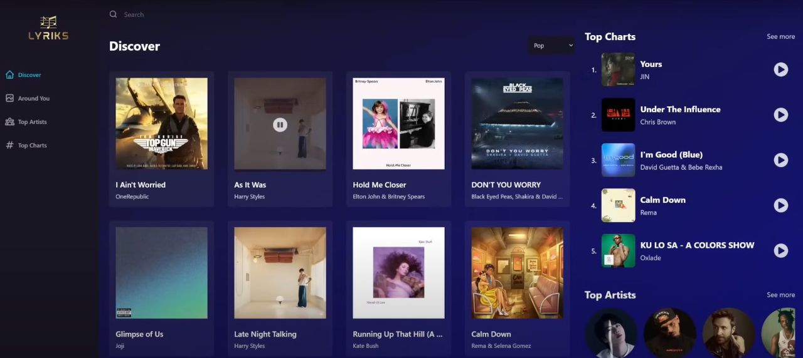
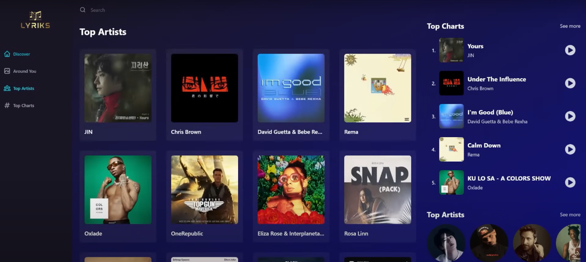
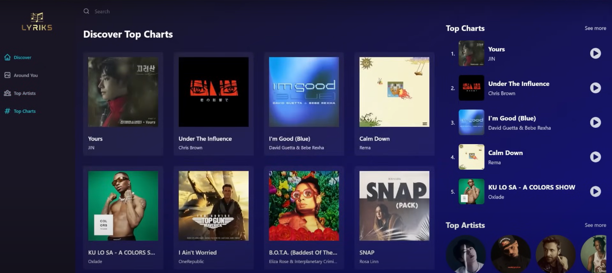
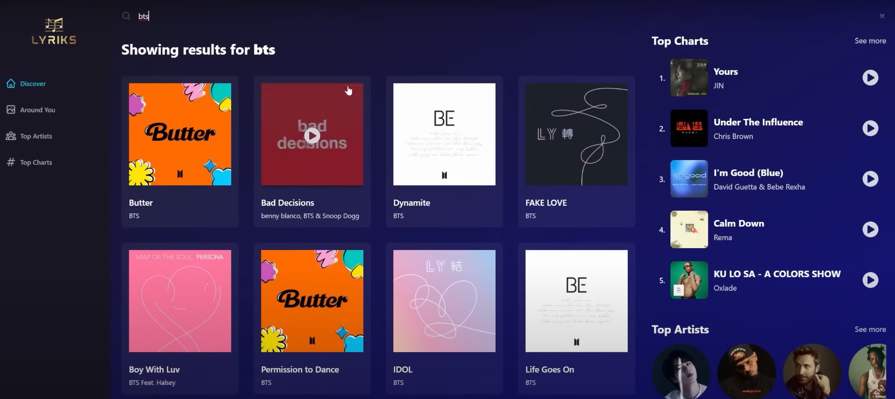

# 🎧 LYRİKS - A Personalized Music Discovery Experience 🎶
# More Polished & Deeper Understanding

This repository presents **LYRİKS**, a feature-rich and visually modern music web app inspired by Spotify. While the project structure is based on a popular tutorial, I significantly reworked the API integration, UI responsiveness, component architecture, and error handling. Over **one intensive week**, I actively debugged, customized, and enhanced the application to deliver a seamless user experience.

---

## 🛠️ What I Worked On

> ✅ Indicates areas where **I made key improvements** during development.

* ✅ **Resolved multiple API integration issues** including header mismatches, 429 (Too Many Requests), and 422 (Unprocessable Content)
* ✅ Rewrote parts of `fetchBaseQuery` logic for better error handling and dynamic headers
* ✅ Customized and cleaned up the UI and UX flows for search, discovery, and artist details
* ✅ Integrated `.env` for securely handling API keys with Vite
* ✅ Refactored reusable components for scalability
* ✅ Enhanced responsiveness and layout rendering with Tailwind CSS tweaks
* ✅ Added meaningful loading and error states across pages
* ✅ Updated UI behavior to mimic real-time music app flow with cleaner controls

---

## 🔥 Features

* 🎵 Trending music discovery based on real-time global data
* 👤 Explore top artists and their music
* 📊 View genre-specific top charts
* 🔍 Search music by artist, song, or keyword
* 🎧 Play short audio previews directly
* 📱 Mobile-responsive layout
* ⚡️ Powered by **Redux Toolkit** and **RapidAPI**
* 🧩 Clean modular folder structure with reusable components
* 🌐 SEO-friendly metadata setup

---

## 📸 Project Screenshots

### 🏠 Discover Page

A curated homepage showing global hits, genre filters, and top trending content.



---

### 👤 Top Artists Page

Top-performing global artists rendered with smooth scrolling and custom hover effects.



---

### 📊 Top Charts Page

Genre-based top charts, enhanced with improved load states and user controls.



---

### 🔎 Search Results

Search functionality restructured for better matching, with clean result rendering.



---

## 🧠 Learnings & Challenges

> Building this project was an intensive learning experience. Here’s what I tackled:

* 🔑 Understood **API rate limits** (HTTP 429) and how to implement cooldowns and fallbacks
* 🔐 Replaced hardcoded API headers with secure `.env` variables using `VITE_` prefix
* ⚠️ Solved **422 content errors** caused by malformed query params
* 📁 Gained hands-on practice with **React component hierarchy, props drilling**, and lifting state
* 🚦 Handled loading and error states more gracefully using custom conditional rendering
* 📐 Practiced responsive layout adjustments for edge cases
* 🧪 Debugged CORS and header mismatch issues between development and deployment

---

## 💡 Tech Stack

| Frontend | State               | Styling      | API                    | Build Tool |
| -------- | ------------------- | ------------ | ---------------------- | ---------- |
| React.js | Redux Toolkit Query | Tailwind CSS | Shazam Core (RapidAPI) | Vite       |

---

## 📁 Folder Structure

```
src/
├── assets/              # Static media & logos
├── components/          # Reusable building blocks
├── pages/               # Route-based pages
├── redux/
│   └── services/        # ShazamCore API logic
├── App.jsx              # Main container
└── main.jsx             # Entry point
```

---

## 🔄 Customization Possibilities

* 🎨 Add themes or light/dark toggle
* 🌍 Filter music by country or region
* 📅 Add a history/playlists feature using localStorage or Firebase
* 🧠 Integrate lyrics API for a full lyrics experience

---

## 🙌 Acknowledgments

* JavaScript Mastery YouTube (as the tutorial base)
* RapidAPI team for robust API support
